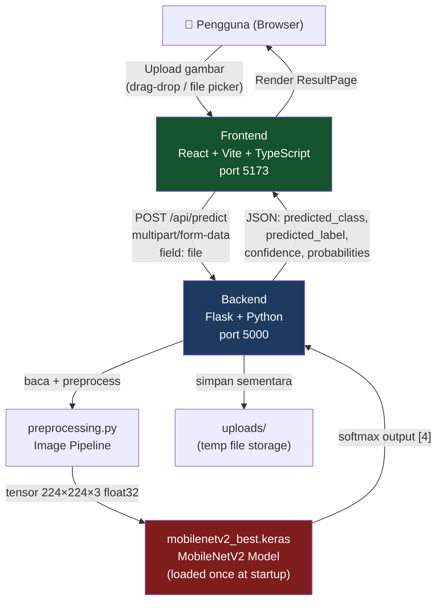
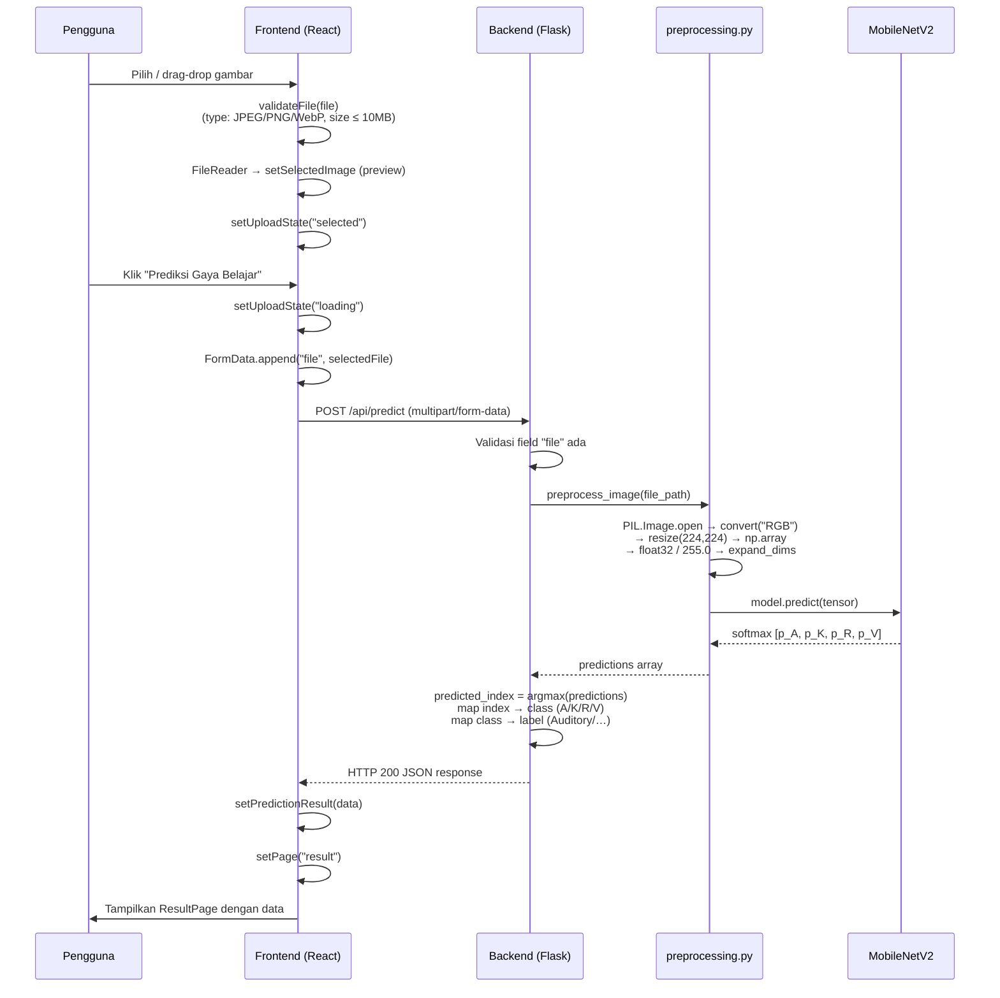
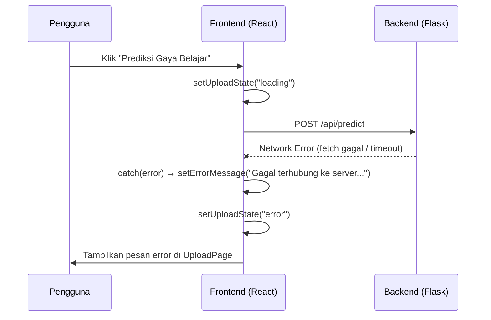
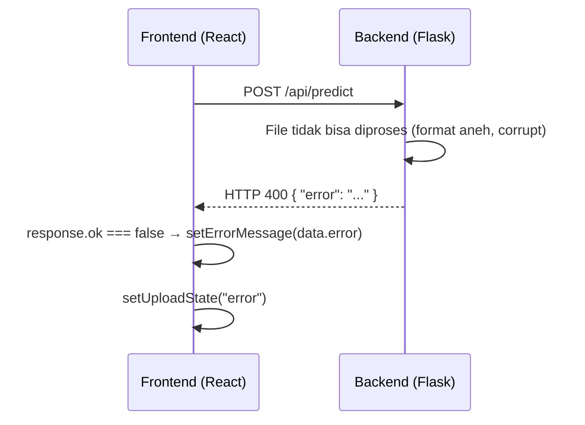

# Design Document: VARK Palmprint Integration

## Overview

Fitur ini menghubungkan frontend React/Vite/TypeScript (hasil export Figma) dengan backend Flask yang memuat model MobileNetV2 untuk mengklasifikasikan gaya belajar VARK dari citra telapak tangan. Integrasi mencakup: (1) backend Flask baru dengan endpoint `POST /api/predict`, (2) modifikasi logika minimal pada `App.tsx` untuk mengganti prototype `setTimeout` dengan API call nyata, dan (3) penampilan hasil prediksi (label, confidence, distribusi probabilitas) di `ResultPage` — tanpa mengubah desain visual frontend sama sekali.

Desain ini mematuhi aturan kritis: model hanya diload sekali saat Flask start, tidak ada retraining, class mapping tetap `[0=A, 1=K, 2=R, 3=V]`, dan CORS hanya diizinkan dari `http://127.0.0.1:5173` dan `http://localhost:5173`.

---

## Architecture



---

## Sequence Diagrams

### Alur Prediksi Utama (Happy Path)



### Alur Error — Backend Tidak Aktif



### Alur Error — File Tidak Valid / Prediksi Gagal



---

## Components and Interfaces

### Backend: `app.py`

**Purpose**: Flask application — endpoint tunggal untuk prediksi, model diload sekali saat startup.

**Interface** (HTTP):

```
POST /api/predict
Content-Type: multipart/form-data
Body field: file (image/jpeg | image/png | image/webp)

Response 200:
{
  "predicted_class": "A" | "K" | "R" | "V",
  "predicted_label": "Auditory" | "Kinesthetic" | "Read/Write" | "Visual",
  "confidence": float (0.0 – 1.0),
  "probabilities": {
    "A": float,
    "K": float,
    "R": float,
    "V": float
  }
}

Response 400:
{ "error": string }

Response 500:
{ "error": string }
```

**Responsibilities**:
- Load model `Backend/model/mobilenetv2_best.keras` SEKALI saat Flask start
- Terima upload file via `request.files["file"]`
- Simpan sementara ke `uploads/` dengan nama aman (uuid)
- Panggil `preprocess_image()` dari `preprocessing.py`
- Jalankan `model.predict()`, map result ke response JSON
- Hapus file temp setelah prediksi selesai (atau error)
- Tangani semua exception agar tidak leak traceback ke client

### Backend: `preprocessing.py`

**Purpose**: Pipeline preprocessing gambar — mengubah file path ke tensor siap predict.

**Interface**:

```python
def preprocess_image(image_path: str) -> np.ndarray:
    """
    Input  : path ke file gambar (JPEG/PNG/WebP)
    Output : numpy array shape (1, 224, 224, 3), dtype float32, nilai [0,1]
    """
```

**Pipeline**:
1. `PIL.Image.open(image_path)`
2. `.convert("RGB")` — pastikan selalu 3 channel
3. `.resize((224, 224))` — target input model
4. `np.array(img, dtype=np.float32)`
5. `/ 255.0` — normalisasi ke [0, 1]
6. `np.expand_dims(arr, axis=0)` — batch dimension → shape (1, 224, 224, 3)

### Frontend: `App.tsx` (modifikasi minimal)

**Purpose**: Mengganti prototype `setTimeout` di `handlePredict` dengan API call nyata, menambahkan state `predictionResult`, dan meneruskan data ke `ResultPage`.

**Tipe baru yang ditambahkan**:

```typescript
interface PredictionResult {
  predicted_class: "A" | "K" | "R" | "V";
  predicted_label: string;
  confidence: number;
  probabilities: {
    A: number;
    K: number;
    R: number;
    V: number;
  };
}
```

**State baru di `App()`**:

```typescript
const [predictionResult, setPredictionResult] = useState<PredictionResult | null>(null);
const [selectedFile, setSelectedFile] = useState<File | null>(null);
```

**Perubahan `handleFileSelect`** — simpan file asli (untuk FormData):

```typescript
const handleFileSelect = useCallback((file: File) => {
  if (!validateFile(file)) return;
  setSelectedFile(file); // simpan File asli
  const reader = new FileReader();
  reader.onload = (e) => {
    setSelectedImage(e.target?.result as string);
    setUploadState("selected");
    setErrorMessage("");
  };
  reader.readAsDataURL(file);
}, []);
```

**Penggantian `handlePredict`**:

```typescript
const handlePredict = async () => {
  if (!selectedFile) return;
  setUploadState("loading");
  try {
    const formData = new FormData();
    formData.append("file", selectedFile);
    const res = await fetch("http://127.0.0.1:5000/api/predict", {
      method: "POST",
      body: formData,
    });
    const data = await res.json();
    if (!res.ok) {
      setErrorMessage(data.error ?? "Prediksi gagal. Coba lagi.");
      setUploadState("error");
      return;
    }
    setPredictionResult(data);
    setPage("result");
  } catch {
    setErrorMessage("Gagal terhubung ke server. Pastikan backend berjalan.");
    setUploadState("error");
  }
};
```

**Perubahan `ResultPage` props** — tambahkan `predictionResult`:

```typescript
{page === "result" && (
  <ResultPage
    selectedImage={selectedImage}
    predictionResult={predictionResult}
    onNavigate={navigateTo}
  />
)}
```

### Frontend: `ResultPage` (render data nyata)

**Purpose**: Menampilkan data dari `predictionResult` menggantikan placeholder statik.

**Bagian yang diubah**:

1. **Predicted class badge** — tampilkan `predictionResult.predicted_class` dengan warna sesuai `VARK_STYLES`
2. **Field "Gaya Belajar"** — `predictionResult.predicted_label`
3. **Field "Kategori VARK"** — `predictionResult.predicted_class`
4. **Field "Confidence"** — `(predictionResult.confidence * 100).toFixed(1) + "%"`
5. **Probability bars** — untuk tiap style, lebar bar = `probabilities[style.key] * 100 + "%"`, teks = persentase

---

## Data Models

### Model: `PredictionResult` (Frontend TypeScript)

```typescript
interface PredictionResult {
  predicted_class: "A" | "K" | "R" | "V";
  predicted_label: "Auditory" | "Kinesthetic" | "Read/Write" | "Visual";
  confidence: number;           // 0.0 – 1.0
  probabilities: {
    A: number;                  // P(Auditory)
    K: number;                  // P(Kinesthetic)
    R: number;                  // P(Read/Write)
    V: number;                  // P(Visual)
  };
}
```

**Validation Rules**:
- `predicted_class` ∈ `{"A", "K", "R", "V"}`
- `confidence` ∈ [0.0, 1.0]
- `probabilities.A + probabilities.K + probabilities.R + probabilities.V ≈ 1.0` (toleransi float)
- `confidence === max(probabilities.A, probabilities.K, probabilities.R, probabilities.V)`

### Model: Class Mapping (Backend Python)

```python
CLASS_NAMES = ["A", "K", "R", "V"]         # index 0,1,2,3
CLASS_LABELS = {
    "A": "Auditory",
    "K": "Kinesthetic",
    "R": "Read/Write",
    "V": "Visual",
}
```

**Aturan wajib**: urutan `CLASS_NAMES` harus tepat sesuai urutan output softmax model — `[0=A, 1=K, 2=R, 3=V]`.

---

## Algorithmic Pseudocode

### Algoritma: `preprocess_image`

```pascal
PROCEDURE preprocess_image(image_path: String): Tensor
  INPUT : image_path — path file gambar yang sudah tersimpan
  OUTPUT: tensor shape (1, 224, 224, 3), float32, nilai [0.0, 1.0]

  PRECONDITION: image_path menunjuk ke file yang dapat dibaca sebagai gambar
  POSTCONDITION: output.shape = (1, 224, 224, 3) AND max(output) <= 1.0

  BEGIN
    img ← PIL.Image.open(image_path)
    img ← img.convert("RGB")                   // pastikan 3 channel
    img ← img.resize((224, 224))               // target ukuran model
    arr ← np.array(img, dtype=float32)         // shape (224, 224, 3)

    ASSERT arr.shape = (224, 224, 3)
    
    arr ← arr / 255.0                          // normalisasi ke [0, 1]
    tensor ← np.expand_dims(arr, axis=0)       // shape (1, 224, 224, 3)

    RETURN tensor
  END
```

### Algoritma: `predict_endpoint`

```pascal
PROCEDURE predict_endpoint(request): JSONResponse
  INPUT : HTTP POST request dengan file gambar di field "file"
  OUTPUT: JSON response dengan prediksi VARK

  PRECONDITION: model sudah dimuat ke memori saat startup

  BEGIN
    IF "file" NOT IN request.files THEN
      RETURN HTTP 400 { "error": "Field 'file' tidak ditemukan" }
    END IF

    file ← request.files["file"]

    IF file.filename = "" THEN
      RETURN HTTP 400 { "error": "Tidak ada file yang diunggah" }
    END IF

    // Simpan file sementara dengan nama unik
    filename ← uuid4() + extension(file.filename)
    file_path ← path.join(UPLOAD_FOLDER, filename)
    file.save(file_path)

    TRY
      tensor ← preprocess_image(file_path)     // (1, 224, 224, 3)
      predictions ← model.predict(tensor)      // shape (1, 4)
      probs ← predictions[0]                   // [p_A, p_K, p_R, p_V]

      predicted_index ← argmax(probs)
      predicted_class ← CLASS_NAMES[predicted_index]
      predicted_label ← CLASS_LABELS[predicted_class]
      confidence ← float(probs[predicted_index])

      probabilities ← {
        "A": float(probs[0]),
        "K": float(probs[1]),
        "R": float(probs[2]),
        "V": float(probs[3])
      }

      RETURN HTTP 200 {
        "predicted_class": predicted_class,
        "predicted_label": predicted_label,
        "confidence": confidence,
        "probabilities": probabilities
      }

    CATCH Exception AS e
      RETURN HTTP 500 { "error": "Prediksi gagal. Coba unggah ulang gambar." }

    FINALLY
      IF file_path EXISTS THEN DELETE file_path END IF
    END TRY

  END
```

### Algoritma: `handlePredict` (Frontend)

```pascal
PROCEDURE handlePredict(): async
  PRECONDITION: selectedFile ≠ null

  BEGIN
    setUploadState("loading")

    formData ← new FormData()
    formData.append("file", selectedFile)

    TRY
      response ← await fetch(API_URL, { method: "POST", body: formData })
      data ← await response.json()

      IF NOT response.ok THEN
        setErrorMessage(data.error ?? "Prediksi gagal. Coba lagi.")
        setUploadState("error")
        RETURN
      END IF

      setPredictionResult(data)
      setPage("result")

    CATCH NetworkError
      setErrorMessage("Gagal terhubung ke server. Pastikan backend berjalan.")
      setUploadState("error")
    END TRY
  END
```

---

## Key Functions with Formal Specifications

### `preprocess_image(image_path: str) → np.ndarray`

**Preconditions:**
- `image_path` adalah path string yang valid
- File di path tersebut dapat dibuka oleh PIL sebagai gambar
- File tersedia di filesystem (belum dihapus)

**Postconditions:**
- Return value memiliki `.shape == (1, 224, 224, 3)`
- Return value memiliki `.dtype == float32`
- Semua nilai dalam range `[0.0, 1.0]`
- Tidak ada side effect pada filesystem

**Loop Invariants:** Tidak ada loop — operasi sekuensial.

---

### `predict_endpoint() → Response` (Flask)

**Preconditions:**
- `model` sudah diload ke memori global (tidak None)
- Request method adalah POST
- `UPLOAD_FOLDER` dapat ditulis

**Postconditions:**
- Selalu mengembalikan JSON response (tidak pernah crash tanpa response)
- HTTP 200 hanya jika prediksi berhasil dan semua field terisi
- File temp selalu dihapus (di `finally` block)
- `probabilities.A + K + R + V ≈ 1.0` (properti softmax)

**Loop Invariants:** Tidak ada loop.

---

### `handlePredict()` (React/TypeScript)

**Preconditions:**
- `selectedFile !== null`
- Backend berjalan di `http://127.0.0.1:5000`

**Postconditions:**
- `uploadState` selalu berubah dari `"loading"` ke `"error"` atau `setPage("result")`
- Tidak pernah stuck di state `"loading"` (semua code path ditangani)
- Jika sukses: `predictionResult` tidak null sebelum `setPage("result")`
- Jika error: `errorMessage` berisi pesan yang dapat dipahami pengguna (bukan traceback)

---

## Example Usage

### Menjalankan Backend

```bash
cd "d:\Website Figma Kiro Terbaru\Backend"
pip install flask flask-cors tensorflow==2.20.0 pillow numpy
python app.py
# Flask running on http://127.0.0.1:5000
```

### Test Manual dengan curl

```bash
curl -X POST http://127.0.0.1:5000/api/predict \
  -F "file=@/path/to/palmprint.jpg"
```

### Contoh Response Sukses

```json
{
  "predicted_class": "V",
  "predicted_label": "Visual",
  "confidence": 0.874,
  "probabilities": {
    "A": 0.043,
    "K": 0.051,
    "R": 0.032,
    "V": 0.874
  }
}
```

### Test Otomatis Backend (gambar sintetis)

```python
# Backend/test_backend.py
import requests
import numpy as np
from PIL import Image
import os

# Buat gambar sintetis 224×224
img = Image.fromarray(np.random.randint(0, 255, (224, 224, 3), dtype=np.uint8))
os.makedirs("test_images", exist_ok=True)
img.save("test_images/synthetic_test.jpg")

# Kirim ke endpoint
with open("test_images/synthetic_test.jpg", "rb") as f:
    res = requests.post("http://127.0.0.1:5000/api/predict", files={"file": f})

data = res.json()
assert res.status_code == 200
assert "predicted_class" in data
assert data["predicted_class"] in ["A", "K", "R", "V"]
assert abs(sum(data["probabilities"].values()) - 1.0) < 1e-4
print("✅ Test passed:", data)
```

---

## Correctness Properties

*A property is a characteristic or behavior that should hold true across all valid executions of a system — essentially, a formal statement about what the system should do. Properties serve as the bridge between human-readable specifications and machine-verifiable correctness guarantees.*

### Property 1: Class Mapping Invariant

*For any* valid palmprint image submitted to `POST /api/predict`, the `predicted_class` field in the response SHALL equal `CLASS_NAMES[argmax(softmax_output)]` where `CLASS_NAMES = ["A", "K", "R", "V"]` — i.e., `predicted_class ∈ {"A", "K", "R", "V"}` for all successful predictions.

**Validates: Requirements 2.2, 2.3**

### Property 2: Probability Sum

*For any* valid palmprint image submitted to `POST /api/predict`, the sum `probabilities.A + probabilities.K + probabilities.R + probabilities.V` in the HTTP 200 response SHALL be within ±1e-4 of 1.0 — a mandatory property of the softmax output distribution.

**Validates: Requirements 2.4**

### Property 3: Confidence Consistency

*For any* HTTP 200 response from `POST /api/predict`, the `confidence` field SHALL equal `max(probabilities.A, probabilities.K, probabilities.R, probabilities.V)` — confidence is always identical to the highest probability among the four classes.

**Validates: Requirements 2.5**

### Property 4: Loading State Completeness

*For any* call to `handlePredict` with a non-null `selectedFile`, the `uploadState` SHALL always transition away from `"loading"` — either to `"error"` (on network failure or non-OK response) or via `setPage("result")` (on success). The `"loading"` state SHALL never be a terminal state.

**Validates: Requirements 7.1, 7.6**

### Property 5: File Cleanup Guarantee

*For any* request handled by `POST /api/predict` (regardless of whether prediction succeeds or an exception is thrown), the temporary file saved to `uploads/` SHALL be deleted in the `finally` block before the response is returned.

**Validates: Requirements 4.2**

### Property 6: Preprocessing Output Invariant

*For any* valid image file (JPEG, PNG, or WebP) of any dimensions that PIL can open, `preprocess_image()` SHALL return a numpy array with shape `(1, 224, 224, 3)`, dtype `float32`, and all values in the closed range `[0.0, 1.0]`.

**Validates: Requirements 3.1, 3.2, 3.3**

### Property 7: Model Singleton

*For any* sequence of prediction requests handled during a single Flask process lifetime, the MobileNetV2 model object SHALL be the same in-memory instance for every request — loaded exactly once at startup and never reloaded per-request.

**Validates: Requirements 1.1, 1.2**

---

## Error Handling

### Skenario 1: Backend tidak aktif

**Kondisi**: `fetch()` melempar `TypeError: Failed to fetch` (network error)
**Response**: `catch` block menangkap, `setErrorMessage("Gagal terhubung ke server. Pastikan backend berjalan.")`
**Recovery**: User melihat UploadPage dalam state `"error"` dengan tombol "Coba Lagi" → kembali ke state `"empty"`

### Skenario 2: File tidak valid (frontend)

**Kondisi**: File bukan JPEG/PNG/WebP, atau ukuran > 10 MB
**Response**: `validateFile()` mengembalikan `false`, pesan spesifik ditampilkan
**Recovery**: State diset ke `"error"`, user bisa memilih file baru

### Skenario 3: Gambar corrupt / tidak bisa diproses (backend)

**Kondisi**: PIL tidak bisa membuka file, atau model.predict() gagal
**Response**: Backend menangkap exception di `try/except`, mengembalikan HTTP 400/500 dengan `{ "error": "..." }`
**Recovery**: Frontend menerima `!res.ok`, menampilkan `data.error` (bukan traceback Python)

### Skenario 4: Field `file` tidak ada dalam request

**Kondisi**: Frontend mengirim FormData tanpa field `file`
**Response**: Backend memeriksa `"file" not in request.files`, mengembalikan HTTP 400
**Recovery**: Frontend menampilkan pesan error generik

### Skenario 5: Model belum diload

**Kondisi**: Tidak seharusnya terjadi jika Flask start normal; jika `keras.models.load_model()` gagal saat startup
**Response**: Flask app berhenti saat startup (crash early), tidak melayani request
**Recovery**: User harus memperbaiki path model atau instalasi TensorFlow

---

## Testing Strategy

### Unit Testing Backend

**File**: `Backend/test_backend.py`

| Test | Deskripsi |
|------|-----------|
| `test_model_loads` | Model berhasil diload tanpa error |
| `test_preprocess_output_shape` | Output `preprocess_image` selalu `(1, 224, 224, 3)` |
| `test_preprocess_dtype` | Output dtype selalu `float32` |
| `test_preprocess_value_range` | Semua nilai dalam `[0.0, 1.0]` |
| `test_predict_synthetic_image` | HTTP 200, semua field ada, `A+K+R+V ≈ 1.0` |
| `test_missing_file_field` | HTTP 400 jika field `file` tidak ada |
| `test_invalid_format` | HTTP 400 untuk file non-gambar |

### Property-Based Testing Approach

**Library**: `hypothesis` (Python)

```python
from hypothesis import given, strategies as st
import numpy as np

@given(st.integers(1, 100), st.integers(1, 100))
def test_preprocess_always_224(width, height):
    """Gambar dengan dimensi sembarang selalu diresize ke 224×224"""
    # Buat gambar acak dengan dimensi bebas
    img = Image.fromarray(np.zeros((height, width, 3), dtype=np.uint8))
    img.save("/tmp/test_img.jpg")
    result = preprocess_image("/tmp/test_img.jpg")
    assert result.shape == (1, 224, 224, 3)
```

**Property**: Untuk semua ukuran gambar input yang valid, output preprocessing selalu `(1, 224, 224, 3)`.

### Integration Testing

1. Jalankan Flask backend
2. Jalankan test dengan gambar sintetis (`test_backend.py`)
3. Validasi response JSON: struktur, tipe data, constraint probabilitas
4. Jalankan frontend dev server, upload gambar nyata, cek ResultPage ter-render dengan data

---

## Performance Considerations

- **Model loading**: MobileNetV2 `.keras` diload sekali saat startup — latency per-request hanya untuk inference (~50–200ms tergantung CPU/GPU)
- **File temp**: File dihapus setelah setiap request — tidak ada akumulasi disk usage
- **Preprocessing**: Operasi PIL + numpy cepat (<20ms untuk gambar biasa)
- **Frontend**: Tidak ada lazy loading yang perlu ditambah; `selectedFile` disimpan di state sehingga tidak perlu baca ulang dari disk

---

## Security Considerations

- **File type validation**: Backend harus memverifikasi content file (via PIL.open) bukan hanya ekstensi nama file
- **File size**: Frontend membatasi 10 MB; backend sebaiknya juga membatasi via `MAX_CONTENT_LENGTH = 10 * 1024 * 1024`
- **Secure filename**: Gunakan UUID untuk nama file temp — cegah path traversal attack
- **CORS**: Hanya izinkan origin `http://127.0.0.1:5173` dan `http://localhost:5173` — tidak buka ke semua origin
- **No traceback exposure**: Semua exception di backend ditangkap; response error berisi pesan generik, bukan traceback Python
- **Uploads folder**: File hanya tersimpan sementara dan selalu dihapus di `finally` block

---

## Dependencies

### Backend (Python)

| Package | Versi | Kegunaan |
|---------|-------|----------|
| `flask` | latest | HTTP server, routing |
| `flask-cors` | latest | CORS header untuk frontend |
| `tensorflow` | `2.20.0` | Load dan jalankan model Keras |
| `keras` | `3.13.2` | (bundled dengan TensorFlow) |
| `pillow` | latest | Buka dan resize gambar |
| `numpy` | latest | Array manipulation, normalisasi |

### Frontend (sudah ada di `package.json`)

| Package | Versi | Kegunaan |
|---------|-------|----------|
| `react` | `18.3.1` | UI framework |
| `typescript` | via vite | Type safety |
| `vite` | `6.3.5` | Dev server + build |
| `tailwindcss` | `4.1.12` | Styling (tidak diubah) |
| `lucide-react` | `0.487.0` | Icons (sudah ada) |

### File Baru yang Dibuat

```
Backend/
├── app.py               ← Flask app + endpoint /api/predict
├── preprocessing.py     ← Image preprocessing pipeline
├── requirements.txt     ← Daftar dependencies Python
├── test_backend.py      ← Test otomatis dengan gambar sintetis
├── uploads/             ← Folder temp (dibuat otomatis)
└── test_images/         ← Gambar sintetis untuk test
```

### Modifikasi pada File yang Ada

```
Frontend/src/app/App.tsx  ← Tambah state + ganti handlePredict + render hasil di ResultPage
```

> **Catatan**: Tidak ada file lain di frontend yang diubah. Desain visual tetap sepenuhnya sesuai export Figma.
